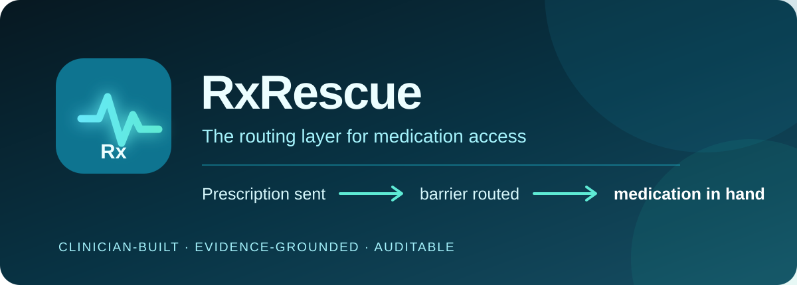
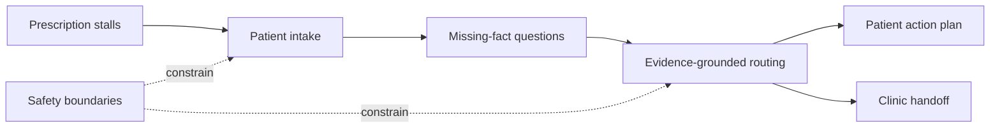

  

  <strong>The routing layer for medication access.</strong> 
  A clinician-built prototype for turning a stalled prescription into an evidence-grounded patient plan and an actionable clinic handoff.

  <a href="#the-problem">Problem</a> ·
  <a href="#what-the-prototype-does">Prototype</a> ·
  <a href="#how-it-works">Architecture</a> ·
  <a href="docs/demo-walkthrough.md">Demo walkthrough</a> ·
  <a href="docs/safety-and-scope.md">Safety & scope</a>

> **Status:** Working single-day hackathon prototype. This repository is a sanitized public showcase; the implementation remains private. Not for clinical use.

## The problem

**The prescription is intent. Access is reality.**

A medication can stall after it is prescribed because of prior authorization, coverage denial, formulary restrictions, price shock, stock-outs, or confusing assistance-program rules. The patient, pharmacy, and clinic often hold different fragments of the answer—and the work of joining them falls into a coordination gap.

In a 2014 primary-care cohort, **31.3% of 37,506 incident prescriptions were not filled within nine months**. Higher medication cost and copayments were associated with nonadherence. [Tamblyn et al., *Annals of Internal Medicine* (2014)](https://pubmed.ncbi.nlm.nih.gov/24687067/)

RxRescue explores a narrow question:

> Once a prescription stalls, can an AI-assisted workflow identify the access barrier, gather the missing facts, ground program-specific guidance in verified evidence, and give both patient and clinic a clear next move?

## What the prototype does

The prototype supports four connected workflows:

| Workflow | Output |
|---|---|
| Patient conversation | Empathetic, structured intake that clarifies what happened at the pharmacy |
| Clinic follow-ups | Missing questions for intake or support staff to resolve next |
| Cost rescue | Program-specific options grounded in curated manufacturer facts |
| Clinic handoff | Concise summary of the barrier, known facts, unknowns, urgency, and next actions |

The goal is not another generic medication chatbot. It is a **coordination layer** that separates:

- what is known;
- what the patient reported;
- what still needs verification; and
- who should do what next.

## Demo scenario

The de-identified hackathon scenario begins with a patient seen by video urgent care for a severe multi-day migraine. A prescription for Nurtec ODT reaches the pharmacy, but the pharmacy reports **Reject 75: prior authorization required** and offers a cash price of roughly **$150 per tablet**.

RxRescue gathers the details needed to distinguish a prior-authorization delay from a coverage exclusion, identifies the relevant clinic and pharmacy follow-ups, checks eligibility-sensitive savings pathways against curated evidence, and generates an auditable handoff.

See the [step-by-step demo walkthrough](docs/demo-walkthrough.md).

## How it works

The hackathon implementation uses:

- **FastAPI** for the application and API layer;
- a responsive, single-page web interface for patient and clinic views;
- the **Anthropic Messages API** for conversation and structured transformations;
- curated medication-assistance facts for program-specific grounding;
- an in-memory session store so the demo persists no PHI; and
- structured, sanitized error handling that does not expose secrets or full patient messages.

The design principle is simple: **the model handles language and synthesis; explicit workflow boundaries and retrieved evidence constrain clinical and access claims.**

Read the [architecture notes](docs/architecture.md) for what exists in the prototype versus what is planned.

## Clinical boundary

RxRescue is designed to coordinate access—not to practice medicine.

It does **not**:

- diagnose or treat a condition;
- prescribe, discontinue, or substitute a medication;
- guarantee coverage, price, inventory, or assistance eligibility;
- turn unverified model recall into a patient-facing program claim; or
- replace the prescribing clinician, pharmacist, payer, or emergency services.

The prototype uses de-identified or synthetic data and stores conversations only in process memory. A production system would require a separate security, privacy, regulatory, validation, and clinical-governance program.

See [Safety, scope, and deployment boundary](docs/safety-and-scope.md).

## What was built at the hackathon

RxRescue was built solo by **Umee Davae, DO**, a board-certified psychiatrist and clinician-builder, during the Abridge × Anthropic × Lightspeed HealthTech hackathon in San Francisco on **July 18, 2026**.

The single-day build demonstrated:

- a live patient intake conversation;
- tappable follow-up responses;
- clinic-facing follow-up questions;
- a clinic summary;
- a cost-rescue pathway grounded in curated manufacturer terms;
- API health and configuration checks; and
- graceful handling of missing keys, rate limits, and upstream failures.

**MAKE**—the Medication Access Knowledge Engine—is the broader concept behind the routing and evidence layer.

## Roadmap

The public roadmap is intentionally capability-focused rather than implementation-specific.

- [x] De-identified patient intake and barrier clarification
- [x] Patient-to-clinic structured handoff
- [x] Curated evidence grounding for a medication assistance scenario
- [x] No-PHI-persistence demo mode
- [ ] Evaluation set for factuality, omission, escalation, and unsafe-action errors
- [ ] Source ingestion with freshness, provenance, and expiration tracking
- [ ] Prior-authorization, formulary, stock, and affordability adapters
- [ ] Human-review queue and audit export
- [ ] Role-based access, consent, retention controls, and production security architecture
- [ ] Supervised clinical pilots with outcome measurement

## Repository boundary

This repository contains public-facing product documentation and sanitized visuals only. It intentionally excludes:

- application source code and prompts;
- proprietary routing logic;
- credentials and environment configuration;
- private payer, formulary, or pharmacy data; and
- any identifiable patient information.

Public visibility does not imply that the private implementation or product IP is licensed for reuse.

## About the creator

**Umee Davae, DO** is a board-certified psychiatrist, clinician-scientist, and AI product builder focused on safer clinical workflows and the operational gaps between a medical decision and real-world care.

Project: **RxRescue.health**  
GitHub: [@goodie3shoes](https://github.com/goodie3shoes)

---

*RxRescue is an early prototype and is not medical advice, a clinical service, or production software.*
