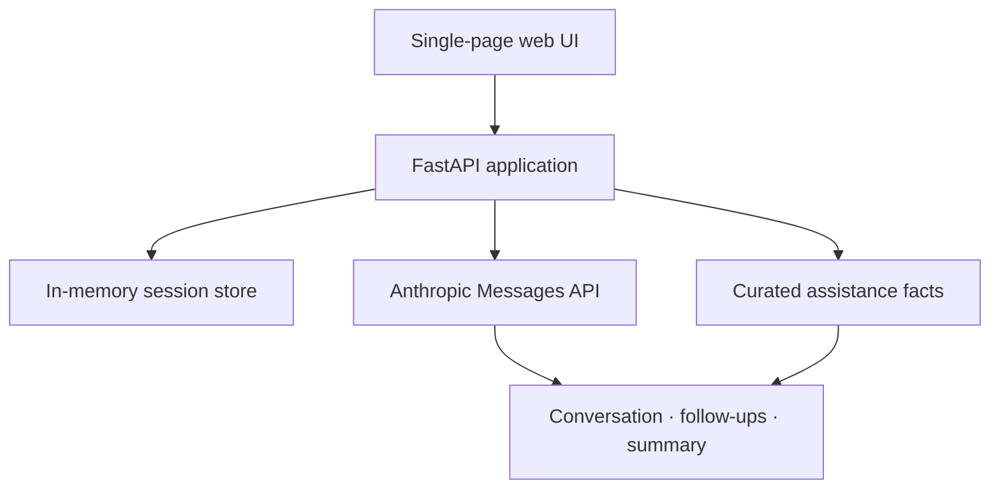
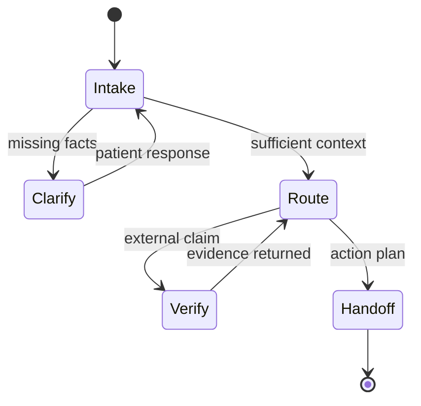

# Architecture

RxRescue is a medication-access coordination prototype with paired patient and clinic views. This document separates the **implemented hackathon system** from the **future production architecture** so the showcase does not imply capabilities that have not been built.

## Implemented prototype

### Components

| Component | Prototype behavior |
|---|---|
| Web interface | Responsive patient conversation and clinic-output panels |
| API layer | Health, chat, follow-up, summary, and savings endpoints |
| Conversation engine | Structured turns through the Anthropic Messages API |
| Evidence layer | Curated medication-assistance facts injected when relevant |
| Session state | In-process memory; reset on server restart |
| Error handling | Sanitized JSON responses for missing configuration, rate limits, network failures, and upstream errors |

### Data boundary

The hackathon build is deliberately ephemeral:

- no database;
- no patient account system;
- no persistent transcript storage;
- no production EHR, payer, pharmacy, or e-prescribing connection; and
- no requirement to place identifiable patient information in the demo.

## Conceptual routing model

A barrier route is not considered resolved merely because the model produced fluent text. Program eligibility, plan coverage, inventory, and payer status are external facts that require a source or human verification.

## Production direction — not yet implemented

A deployable system would add:

- authenticated patient, clinic, and administrator roles;
- consent, minimum-necessary data collection, retention controls, and audit logging;
- source connectors with provenance, freshness, jurisdiction, and expiration metadata;
- deterministic policy checks around high-risk outputs;
- a human-review queue for ambiguous or clinically sensitive cases;
- EHR and task-workflow integration;
- monitoring for factuality, omission, latency, drift, and unsafe escalation behavior; and
- security, privacy, clinical-governance, legal, and regulatory review.

## Public/private boundary

The public repository documents interfaces, behaviors, and safety principles. Source code, prompts, proprietary routing logic, private data, and implementation-specific evaluation material remain outside the showcase.

[Back to README](../README.md)
